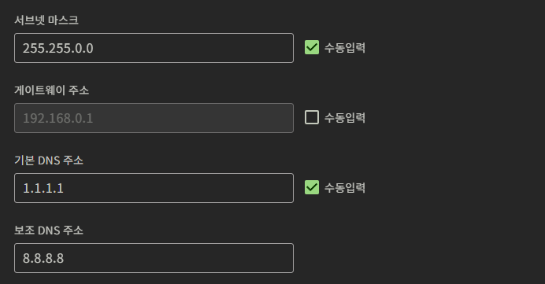
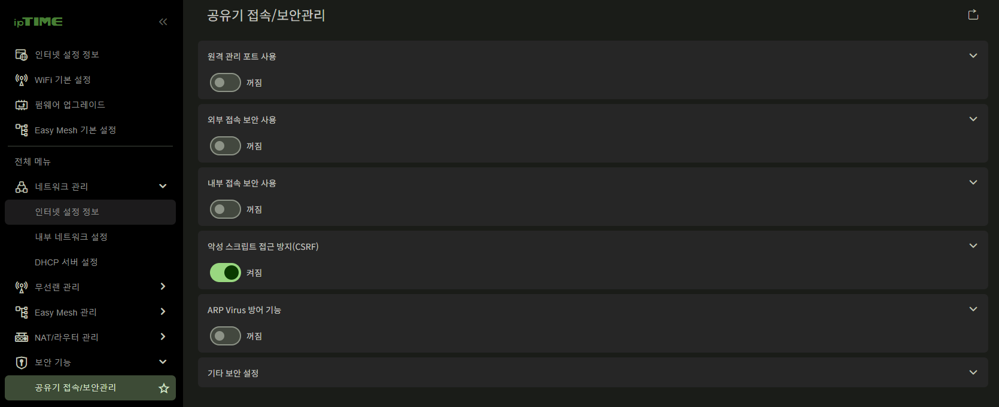
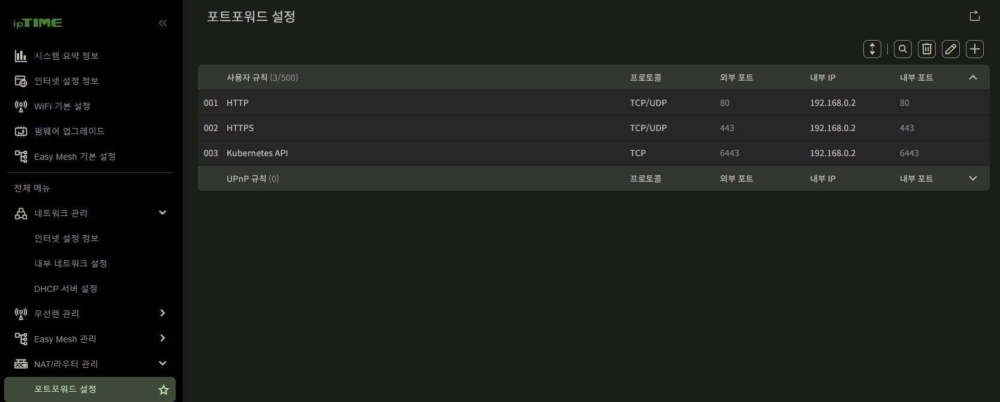
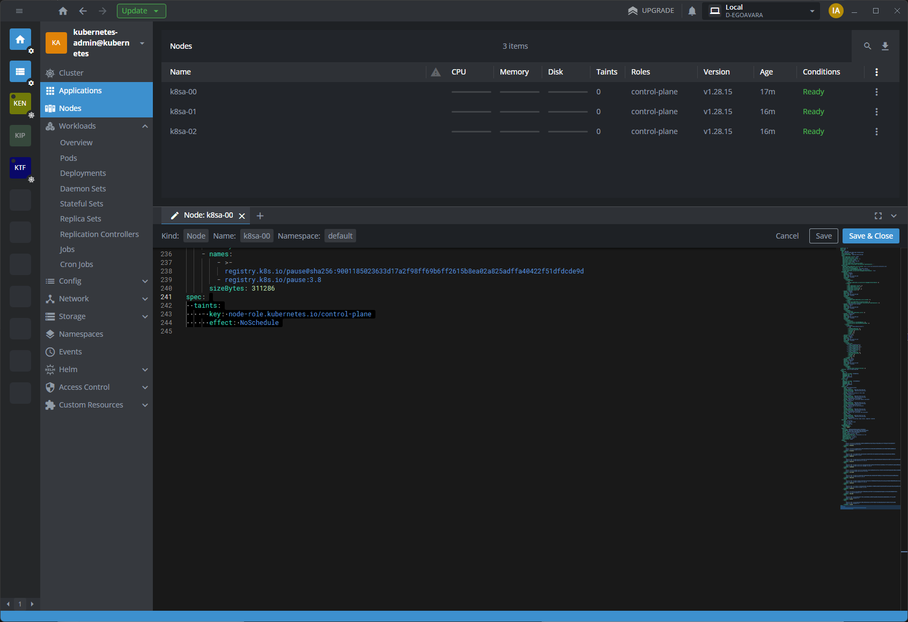
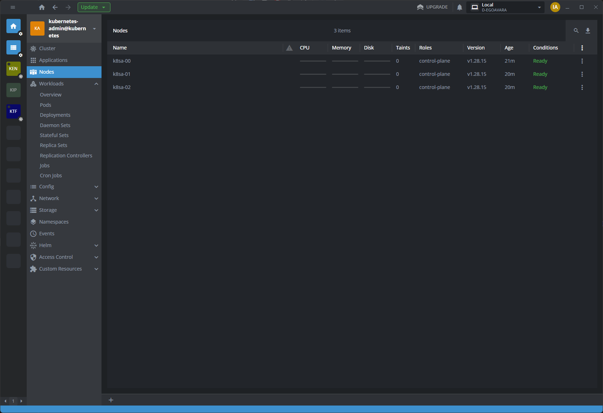

# 쿠버네티스 클러스터 구축기
## 공유기 설정
### 서브넷 설정
공유기 서브넷은 기본이 `192.168.0.0/24`로 되어 있는데 이 영역은 IP 대역이 너무 적으므로 `192.168.0.0/16`으로 변경함.



### DHCP IP 임대 범위를 변경

`192.168.0.100 - 192.168.0.254`로 임대 범위를 변경함
`192.168.0.2 - 192.168.0.100`까지는 내 기기를 MAC 기반으로 고정 할당하고 있음

### ARP Virus 기능 비활성화

차후 사용할 L2 announcement LoadBalancer는 ARP를 이용해 로드밸런서를 흉내내기에 이 옵션이 켜지면 그냥 아무것도 안됨.



### 포트포워딩 설정

포트포워딩 설정함.

참고로 192.168.0.2는 라즈베리 기반 리버스 프록시 (로드밸런서 용도로 사용 중)

그냥 `192.168.0.100, 192.168.0.101, 192.168.0.102` 중 하나로 리다이렉션만 시키고 있음.



## 클러스터 구축 과정

### Ubuntu 포맷
rafus protable 을 이용해 포맷

nvme SSD 에 bootloader, ext4 를 / 로 마운트해서 포맷
HDD는 ext로 포맷만 하고 마운트는 제외

### apt 최신화

```bash
sudo apt update
sudo apt upgrade
sudo reboot now
```

### nvidia 드라이버 설치

apt upgrade로 인해 nvidia G210 그래픽카드의 문제인지 gdm3에 문제가 생겨 화면이 마우스 포인터만 보임,
nvidia 드라이버를 별도로 설치하면 해결됨을 확인

```bash
sudo apt install nvidia-driver-550
sudo reboot now
```

참고로 G210은 550 드라이버를 설치해도 레거시 드라이버 모드로 동작하기에 과도하게 높은 버전이나 뭐 어찌되었건 동작함.

### SSH 설정

```bash
sudo apt install openssh-server
sudo systemctl start ssh
sudo systemctl enable ssh
```

### 쿠버네티스 유틸 설치

쿠버네티스 공식 홈페이지에서는 `https://apt.kubernetes.io/`를 apt keyring으로 이용하라 하는데 실제로는 2023년 9월 13일 이후로 제공 중단된 레포임.
`pkgs.k8s.io`를 대신 이용해야 함.

```bash
sudo apt install apt-transport-https ca-certificates curl
sudo curl -fsSLo /etc/apt/keyrings/kubernetes-archive-keyring.gpg https://packages.cloud.google.com/apt/doc/apt-key.gpg
## echo "deb [signed-by=/etc/apt/keyrings/kubernetes-archive-keyring.gpg] https://apt.kubernetes.io/ kubernetes-xenial main" | sudo tee /etc/apt/sources.list.d/kubernetes.list
echo "deb [signed-by=/etc/apt/keyrings/kubernetes-apt-keyring.gpg] https://pkgs.k8s.io/core:/stable:/v1.28/deb/ /" | sudo tee /etc/apt/sources.list.d/kubernetes.list
curl -fsSL https://pkgs.k8s.io/core:/stable:/v1.28/deb/Release.key | sudo gpg --dearmor -o /etc/apt/keyrings/kubernetes-apt-keyring.gpg
sudo apt update

sudo apt install kubelet kubeadm kubectl
sudo apt-mark hold kubelet kubeadm kubectl
```

### 쿠버네티스 설치 요구조건


#### 노드간 주소 충돌 검증
각 노드에서 MAC 주소 충돌을 확인
```bash
ip link
sudo cat /sys/class/dmi/id/product_uuid
```

#### 포트 6443 사용 가능 여부 확인

깡통 OS라 생략

#### containerd (CRI) 설치

```bash
curl -fsSL https://download.docker.com/linux/ubuntu/gpg | sudo apt-key add -
sudo add-apt-repository "deb [arch=amd64] https://download.docker.com/linux/ubuntu $(lsb_release -cs) stable"
sudo apt update
sudo apt install containerd.io
sudo apt-mark hold containerd.io

sudo systemctl start containerd
sudo systemctl enable containerd

mkdir -p /etc/containerd
containerd config default > /etc/containerd/config.toml
```

이후 kubeadm 이 요구하는 cgroup 설정 `/etc/containerd/config.toml`에 반영

```
[plugins."io.containerd.grpc.v1.cri".containerd.runtimes.runc]
  ...
  [plugins."io.containerd.grpc.v1.cri".containerd.runtimes.runc.options]
    SystemdCgroup = true
```

```bash
sudo systemctl restart containerd
```

#### 스왑 메모리 제거

```bash
sudo swapoff -a
sudo sed -i '/swap/s/^/#/' /etc/fstab
```

#### 필수 커널 모듈 로드

```bash
sudo modprobe br_netfilter

## 커널 모듈을 지정
cat <<EOF | sudo tee /etc/modules-load.d/k8s.conf
br_netfilter
EOF

cat <<EOF | sudo tee /etc/sysctl.d/k8s.conf
net.bridge.bridge-nf-call-ip6tables = 1
net.bridge.bridge-nf-call-iptables = 1
EOF

sudo sysctl --system
```

#### 일단 잘 모르겠고 재부팅

kubeadm과 kubelet과 kubectl의 이름으로 쿠멘...
```bash
sudo reboot now
```

### 클러스터 생성

#### 도메인 배포

멀티 마스터 클러스터를 위해서는 `--control-plane-endpoint`를 제공해야 함.
내 경우, 내가 소유한 도메인을 GCP CloudDNS를 통해 아래와 같이 설정했음

```
[private-kubernetes.???.net]
+A 192.168.0.110

[kubernetes.???.net]
+CNAME {iptime 공유기 ip to domain 등록 기능을 이용}
```
private 주소는 내부 통신용으로 public dns 시만 내부망의 IP를 등록
아래 주소는 실제 public 웹에서 접속을 위해 구성

#### 클러스터 초기화

나의 경우에는 클러스터에 접속하는 도메인이 2개여서 아래와 같이 구성해 업로드

upload-certs는 필수 옵션은 아닌데, 나중에 마스터 추가해야 할때 이거 없으면 골치아파질 듯 그냥 추가

```bash
k8sa-00@k8sa-00:~$ sudo kubeadm init \
  --control-plane-endpoint "private-kubernetes.???.net:6443" \
  --upload-certs \
  --apiserver-cert-extra-sans kubernetes.???.net
  
k8sa-00@k8sa-00:~$ sudo kubeadm init --control-plane-endpoint "private-kubernetes.???.net:6443" --upload-certs 
I0213 22:46:45.060840   44608 version.go:256] remote version is much newer: v1.32.2; falling back to: stable-1.28
[init] Using Kubernetes version: v1.28.15
[preflight] Running pre-flight checks
[preflight] Pulling images required for setting up a Kubernetes cluster
[preflight] This might take a minute or two, depending on the speed of your internet connection
[preflight] You can also perform this action in beforehand using 'kubeadm config images pull'
W0213 22:46:45.600449   44608 checks.go:835] detected that the sandbox image "registry.k8s.io/pause:3.8" of the container runtime is inconsistent with that used by kubeadm. It is recommended that using "registry.k8s.io/pause:3.9" as the CRI sandbox image.
[certs] Using certificateDir folder "/etc/kubernetes/pki"
[certs] Generating "ca" certificate and key
[certs] Generating "apiserver" certificate and key
[certs] apiserver serving cert is signed for DNS names [private-kubernetes.???.net k8sa-00 kubernetes kubernetes.default kubernetes.default.svc kubernetes.default.svc.cluster.local] and IPs [10.96.0.1 192.168.0.110]
[certs] Generating "apiserver-kubelet-client" certificate and key
[certs] Generating "front-proxy-ca" certificate and key
[certs] Generating "front-proxy-client" certificate and key
[certs] Generating "etcd/ca" certificate and key
[certs] Generating "etcd/server" certificate and key
[certs] etcd/server serving cert is signed for DNS names [k8sa-00 localhost] and IPs [192.168.0.110 127.0.0.1 ::1]
[certs] Generating "etcd/peer" certificate and key
[certs] etcd/peer serving cert is signed for DNS names [k8sa-00 localhost] and IPs [192.168.0.110 127.0.0.1 ::1]
[certs] Generating "etcd/healthcheck-client" certificate and key
[certs] Generating "apiserver-etcd-client" certificate and key
[certs] Generating "sa" key and public key
[kubeconfig] Using kubeconfig folder "/etc/kubernetes"
[kubeconfig] Writing "admin.conf" kubeconfig file
[kubeconfig] Writing "kubelet.conf" kubeconfig file
[kubeconfig] Writing "controller-manager.conf" kubeconfig file
[kubeconfig] Writing "scheduler.conf" kubeconfig file
[etcd] Creating static Pod manifest for local etcd in "/etc/kubernetes/manifests"
[control-plane] Using manifest folder "/etc/kubernetes/manifests"
[control-plane] Creating static Pod manifest for "kube-apiserver"
[control-plane] Creating static Pod manifest for "kube-controller-manager"
[control-plane] Creating static Pod manifest for "kube-scheduler"
[kubelet-start] Writing kubelet environment file with flags to file "/var/lib/kubelet/kubeadm-flags.env"
[kubelet-start] Writing kubelet configuration to file "/var/lib/kubelet/config.yaml"
[kubelet-start] Starting the kubelet
[wait-control-plane] Waiting for the kubelet to boot up the control plane as static Pods from directory "/etc/kubernetes/manifests". This can take up to 4m0s
[apiclient] All control plane components are healthy after 4.165065 seconds
[upload-config] Storing the configuration used in ConfigMap "kubeadm-config" in the "kube-system" Namespace
[kubelet] Creating a ConfigMap "kubelet-config" in namespace kube-system with the configuration for the kubelets in the cluster
[upload-certs] Storing the certificates in Secret "kubeadm-certs" in the "kube-system" Namespace
[upload-certs] Using certificate key:
...
[mark-control-plane] Marking the node k8sa-00 as control-plane by adding the labels: [node-role.kubernetes.io/control-plane node.kubernetes.io/exclude-from-external-load-balancers]
[mark-control-plane] Marking the node k8sa-00 as control-plane by adding the taints [node-role.kubernetes.io/control-plane:NoSchedule]
[bootstrap-token] Using token: ...
[bootstrap-token] Configuring bootstrap tokens, cluster-info ConfigMap, RBAC Roles
[bootstrap-token] Configured RBAC rules to allow Node Bootstrap tokens to get nodes
[bootstrap-token] Configured RBAC rules to allow Node Bootstrap tokens to post CSRs in order for nodes to get long term certificate credentials
[bootstrap-token] Configured RBAC rules to allow the csrapprover controller automatically approve CSRs from a Node Bootstrap Token
[bootstrap-token] Configured RBAC rules to allow certificate rotation for all node client certificates in the cluster
[bootstrap-token] Creating the "cluster-info" ConfigMap in the "kube-public" namespace
[kubelet-finalize] Updating "/etc/kubernetes/kubelet.conf" to point to a rotatable kubelet client certificate and key
[addons] Applied essential addon: CoreDNS
[addons] Applied essential addon: kube-proxy

Your Kubernetes control-plane has initialized successfully!

To start using your cluster, you need to run the following as a regular user:

  mkdir -p $HOME/.kube
  sudo cp -i /etc/kubernetes/admin.conf $HOME/.kube/config
  sudo chown $(id -u):$(id -g) $HOME/.kube/config

Alternatively, if you are the root user, you can run:

  export KUBECONFIG=/etc/kubernetes/admin.conf

You should now deploy a pod network to the cluster.
Run "kubectl apply -f [podnetwork].yaml" with one of the options listed at:
  https://kubernetes.io/docs/concepts/cluster-administration/addons/

You can now join any number of the control-plane node running the following command on each as root:

  kubeadm join private-kubernetes.???.net:6443 --token ... \
        --discovery-token-ca-cert-hash sha256:... \
        --control-plane --certificate-key ...

Please note that the certificate-key gives access to cluster sensitive data, keep it secret!
As a safeguard, uploaded-certs will be deleted in two hours; If necessary, you can use
"kubeadm init phase upload-certs --upload-certs" to reload certs afterward.

Then you can join any number of worker nodes by running the following on each as root:

kubeadm join private-kubernetes.???.net:6443 --token ... \
        --discovery-token-ca-cert-hash sha256:...
```

위 초기화 명령어 제일 아래에 보면 클러스터에 합류하기 위한 코드도 섞여 있음

#### 클러스터에 control-plane 추가

```bash
k8sa-01@k8sa-01:~$ sudo kubeadm join private-kubernetes.???.net:6443 --token ... \
        --discovery-token-ca-cert-hash sha256:... \
        --control-plane --certificate-key ...

[preflight] Running pre-flight checks
[preflight] Reading configuration from the cluster...
[preflight] FYI: You can look at this config file with 'kubectl -n kube-system get cm kubeadm-config -o yaml'
[preflight] Running pre-flight checks before initializing the new control plane instance
[preflight] Pulling images required for setting up a Kubernetes cluster
[preflight] This might take a minute or two, depending on the speed of your internet connection
[preflight] You can also perform this action in beforehand using 'kubeadm config images pull'
W0213 22:49:00.484006   47712 checks.go:835] detected that the sandbox image "registry.k8s.io/pause:3.8" of the container runtime is inconsistent with that used by kubeadm. It is recommended that using "registry.k8s.io/pause:3.9" as the CRI sandbox image.
[download-certs] Downloading the certificates in Secret "kubeadm-certs" in the "kube-system" Namespace
[download-certs] Saving the certificates to the folder: "/etc/kubernetes/pki"
[certs] Using certificateDir folder "/etc/kubernetes/pki"
[certs] Generating "etcd/peer" certificate and key
[certs] etcd/peer serving cert is signed for DNS names [k8sa-01 localhost] and IPs [192.168.0.111 127.0.0.1 ::1]
[certs] Generating "etcd/healthcheck-client" certificate and key
[certs] Generating "etcd/server" certificate and key
[certs] etcd/server serving cert is signed for DNS names [k8sa-01 localhost] and IPs [192.168.0.111 127.0.0.1 ::1]
[certs] Generating "apiserver-etcd-client" certificate and key
[certs] Generating "apiserver-kubelet-client" certificate and key
[certs] Generating "apiserver" certificate and key
[certs] apiserver serving cert is signed for DNS names [private-kubernetes.???.net k8sa-01 kubernetes kubernetes.default kubernetes.default.svc kubernetes.default.svc.cluster.local] and IPs [10.96.0.1 192.168.0.111]
[certs] Generating "front-proxy-client" certificate and key
[certs] Valid certificates and keys now exist in "/etc/kubernetes/pki"
[certs] Using the existing "sa" key
[kubeconfig] Generating kubeconfig files
[kubeconfig] Using kubeconfig folder "/etc/kubernetes"
[kubeconfig] Writing "admin.conf" kubeconfig file
[kubeconfig] Writing "controller-manager.conf" kubeconfig file
[kubeconfig] Writing "scheduler.conf" kubeconfig file
[control-plane] Using manifest folder "/etc/kubernetes/manifests"
[control-plane] Creating static Pod manifest for "kube-apiserver"
[control-plane] Creating static Pod manifest for "kube-controller-manager"
[control-plane] Creating static Pod manifest for "kube-scheduler"
[check-etcd] Checking that the etcd cluster is healthy
[kubelet-start] Writing kubelet configuration to file "/var/lib/kubelet/config.yaml"
[kubelet-start] Writing kubelet environment file with flags to file "/var/lib/kubelet/kubeadm-flags.env"
[kubelet-start] Starting the kubelet
[kubelet-start] Waiting for the kubelet to perform the TLS Bootstrap...
[etcd] Announced new etcd member joining to the existing etcd cluster
[etcd] Creating static Pod manifest for "etcd"
[etcd] Waiting for the new etcd member to join the cluster. This can take up to 40s
The 'update-status' phase is deprecated and will be removed in a future release. Currently it performs no operation
[mark-control-plane] Marking the node k8sa-01 as control-plane by adding the labels: [node-role.kubernetes.io/control-plane node.kubernetes.io/exclude-from-external-load-balancers]
[mark-control-plane] Marking the node k8sa-01 as control-plane by adding the taints [node-role.kubernetes.io/control-plane:NoSchedule]

This node has joined the cluster and a new control plane instance was created:

* Certificate signing request was sent to apiserver and approval was received.
* The Kubelet was informed of the new secure connection details.
* Control plane label and taint were applied to the new node.
* The Kubernetes control plane instances scaled up.
* A new etcd member was added to the local/stacked etcd cluster.

To start administering your cluster from this node, you need to run the following as a regular user:

        mkdir -p $HOME/.kube
        sudo cp -i /etc/kubernetes/admin.conf $HOME/.kube/config
        sudo chown $(id -u):$(id -g) $HOME/.kube/config

Run 'kubectl get nodes' to see this node join the cluster.
```

#### 각 노드에서 .kube/config 파일 추출
```bash
mkdir -p $HOME/.kube
sudo cp -i /etc/kubernetes/admin.conf $HOME/.kube/config
sudo chown $(id -u):$(id -g) $HOME/.kube/config

kubectl get nodes
```

#### 클러스터의 taint 수정

내 클러스터는 control-plane 으로만 구성되었고 worker node가 없는 구성이라 master node에서도 파드가 돌아가도록 조정.



위 taint 제거

#### 필수 컴포넌트인 CNI 설치

처음에는 calico + metallb로 구성했다가 수많은 억까와 ARP 무응답과 네트워크 문제가 발생해 그냥 calico로 설치
CNI를 설치해야 `kubectl get nodes`를 했을때 노드가 `Ready`상태가 되더라.

```bash
CILIUM_CLI_VERSION=$(curl -s https://raw.githubusercontent.com/cilium/cilium-cli/main/stable.txt)
CLI_ARCH=amd64
if [ "$(uname -m)" = "aarch64" ]; then CLI_ARCH=arm64; fi
curl -L --fail --remote-name-all https://github.com/cilium/cilium-cli/releases/download/${CILIUM_CLI_VERSION}/cilium-linux-${CLI_ARCH}.tar.gz{,.sha256sum}
sha256sum --check cilium-linux-${CLI_ARCH}.tar.gz.sha256sum
sudo tar xzvfC cilium-linux-${CLI_ARCH}.tar.gz /usr/local/bin
rm cilium-linux-${CLI_ARCH}.tar.gz{,.sha256sum}

cilium install --version 1.17.1

cilium status --wait
```

#### cilium 설정 변경
`cilium` helm에 아래 내용 추가

```
l2announcements:
  enabled: true
  
k8sClientRateLimit:
  burst: 120
  operator:
    burst: null
    qps: null
  qps: 60
```
- k8s-client-qps, k8s-client-burst 는 뭔지 잘 모르겠다...

```
kubeProxyReplacement: "false"
cni:
  exclusive: false
socketLB:
  hostNamespaceOnly: true 
```
해당 옵션은 istio ambient mode를 위해 필요 안쓸거라면 필요는 없는데 해 둬도 문제는 없음

#### cilium 권한 수정

기본설치된 cilium에는 `coordination.k8s.io/leases` 리소스에 대한 권한이 없어 L2 announcements 기능이 사용 불능

```bash
kubectl edit clusterrole cilium
```

클러스터 권한에 아래 부분 추가

```
...
- apiGroups:
  - coordination.k8s.io
  resources:
  - leases
  verbs:
  - create
  - get
  - update
  - list
  - delete
```

#### L2 로드밸런서 구축 (cilium 기능)

이걸 구축하면 클러스터에서 LoadBalancer 서비스를 만들었을때 주어진 IP 풀에서 IP를 할당해 줄 수 있음.

다만 주의할 것은 아래 과정에서 다시 언급할텐데 공유기가 임대할 수 있는 DHCP 대역하고 충돌해서는 안되며 공유기의 서브넷과 일치하는 범위로 IP POOL을 잡아야 함.

```bash
kubectl apply -f - <<EOF
apiVersion: "cilium.io/v2alpha1"
kind: CiliumL2AnnouncementPolicy
metadata:
  name: ???-policy
spec:
  interfaces:
  - enp4s0
  externalIPs: true
  loadBalancerIPs: true
EOF

kubectl apply -f - <<EOF
apiVersion: "cilium.io/v2alpha1"
kind: CiliumLoadBalancerIPPool
metadata:
  name: "???-net-pool"
spec:
  blocks:
  - cidr: "192.168.220.0/24"
EOF
```

#### `private-kubernetes.???.net` 도메인에 나머지 노드 추가

```
[private-kubernetes.???.net]
+A 192.168.0.110
+A 192.168.0.111
+A 192.168.0.112
```

#### 일단 재부팅

잘은 모르겠지만 ARP 문제라던가, 네트워크 문제라던가, 컨테이너 문제라던가, ETCD 문제라던가 뭐든 이거 한방이면 다 해결됨

```bash
sudo reboot now
```

## 클러스터 구축 검증

### kubeconfig 복사

노드에서 `/etc/kubernetes/admin.conf` 파일 내용을 복사함.

이후 기본 설정에서 name 필드는 내 마음대로 바꿈

이후 public 웹에서 접근해야 하므로 호스트 주소를 `private-kubernetes.???.net`에서 `kubernetes.???.net` 으로 수정

```
apiVersion: v1
clusters:
- cluster:
    certificate-authority-data: ...
    server: https://kubernetes.???.net:6443
  name: kubernetes-???-net
contexts:
- context:
    cluster: kubernetes-???-net
    user: admin@kubernetes-???-net
  name: admin@kubernetes-???-net
current-context: admin@kubernetes-???-net
kind: Config
preferences: {}
users:
- name: admin@kubernetes-???-net
  user:
    client-certificate-data: ...
    client-key-data: ...
```

### 노드를 제외한 PC에서 접근 확인




## 앞으로 할 것

### 서브넷 분리

```
`10.1.0.1/32` -> iptime 공유기(gateway)
`10.1.0.53/32` -> local DNS
`10.1.0.80/32` -> local LB HTTP, HTTPS

`10.1.1.1/32` -> 내 개인 PC
`10.1.1.2/32` -> 맥북
`10.1.1.10 - 10.1.1.99` -> IoT 장비 대역
`10.1.1.100 - 10.1.1.254` -> DHCP에서 자동 임대해주는 대역

`10.2.1.0/24` -> 라즈베리 파이 대역
`10.2.2.0/24` -> 쿠버네티스 노드 대역
`10.2.130.0/24` -> 쿠버네티스 노드 nanokvm 대역


`10.101.0.0/16` -> 쿠버네티스 파드 서브넷
`10.102.240.0/20` -> 쿠버네티스 로드밸런서 서브넷
```

쿠버네티스 클러스터 노드들 IP를 완전히 변경할 예정


### cilium k8s-client-qps, k8s-client-burst 정체 알아내고 재설정

이게 뭔지 잘 모르겠고 어느정도가 적당한지도 모르겠음

### pod IP 를 서브넷에 전파할 수 있게 수정

이거 쓰면 파드도 서브넷에 L2 ARP로 전파한다는데 이걸 쓰면 서비스 안만들어도 개발 PC로 파드에 직접 접근이 가능할 듯...?
```
l2podAnnouncements:
  enabled: false
```